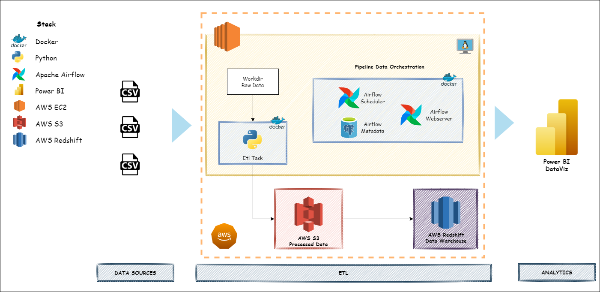

# Criacao de um Banco de Dados Dimensional

> Projeto pratico em modo de desafio com a criacao de um banco de dados dimensional desenvolvido como atividade avaliativa do Bootcamp Engenheiro de Dados da XPEducacao.

O modelo dimensional foi criado a partir das metricas propostas pelo [desafio](docs/desafio_xp.pdf).

Visando tornar o projeto mais robusto, criou-se um pipeline de dados orquestrado pelo **Apache Airflow** que recupera os dados em formato `.csv`, realiza os procedimentos de transformacao e compatibilizacao dos dados com o modelo dimensional desenhado.

Os dados modelados sao colocados em um bucket da **AWS S3** e, por fim, os dados sao armazenados em um cluster na **AWS Redshift**.

Os dados do Redshift sao consumidos pelo **Power BI**, onde sera criado um dashboard de acordo com as metricas e necessidades de negocio levantadas.

## **Ambiente de Desenvolvimento**

[Docker 20.10.17](https://www.docker.com/)   

## **Arquitetura de Dados**


## **Como Executar este Projeto**

1. Crie uma instancia no `AWS EC2` ou outro provedor da sua escolha, realize o download deste repositorio e execute o docker-compose para realizar o build dos containers:
```bash
docker-compose up -d
```

2. Criar um bucket no `AWS S3` com o nome *etl-seguros*.
3. No painel web do `Apache Airflow` cadastrar a variavel *aws_default_secret* com os dados de acesso da sua conta aws:
```
{
    "aws_access_key_id": "",
    "aws_secret_access_key"
}
```

4. Crie um database chamado **seguros** dentro de cluster na `AWS Redshift`. No painel web do `Apache Airflow` cadastrar a variavel *aws_redshift_seguros_secret* com os dados de acesso ao banco:
```
{
    "user": "",
    "password": ""
}
```
5. Executar o pipeline de dados no `Apache Airflow`
6. Configurar e criar as visualizacoes no `Power BI`

## **Dashboard**
[](https://app.powerbi.com/view?r=eyJrIjoiNmIwNDg1ZjctZmY0YS00ZjYwLTlhYjgtMjcxNjQyZDJhZWY1IiwidCI6IjM0Zjc1YTY1LWUzYWItNDY3Yy1hNzhhLTcxNjkwNTBjMWY5MSJ9)  

## **Referencias**

A documentacao completa do projeto esta disponivel neste link: https://julioszeferino.github.io/banco_de_dados_dimensional/ 

## Histórico de Atualizações

* 0.0.1
    * Projeto Inicial

## Direitos de Uso
A ideia deste repositório é treinar os conceitos de Pipelines de Dados e compartilhar conhecimento. Dessa forma, você pode replicar e utilizar o conteúdo deste repositório sem nenhuma restrição desde que forneça uma atribuição de volta e não me responsabilize por quaisquer reclamações, danos ou responsabilidades.  

Exigido | Permitido |Proibido
:---: | :---: | :---:
Aviso de licença e direitos autorais | Uso comercial | Responsabilidade Assegurada
 || Modificação ||
 || Distribuição || 
 || Sublicenciamento ||

## Meta

Julio Zeferino - [@Linkedin](https://www.linkedin.com/in/julioszeferino/) - julioszeferino@gmail.com
[https://github.com/julioszeferino] 
