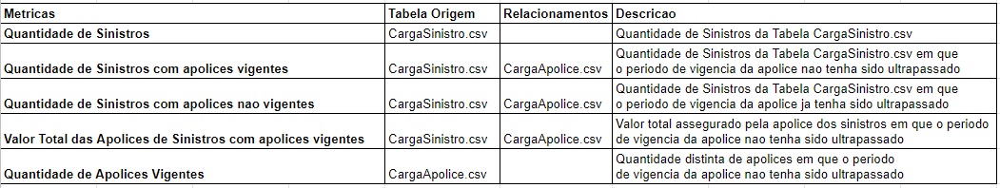
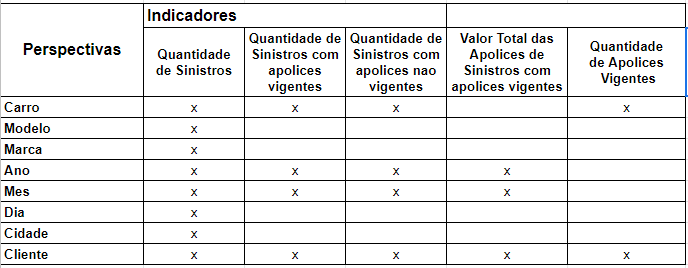
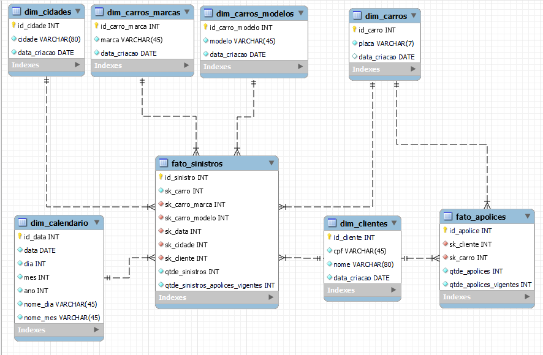
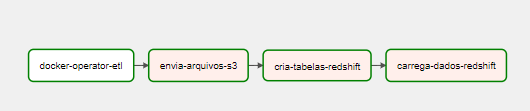
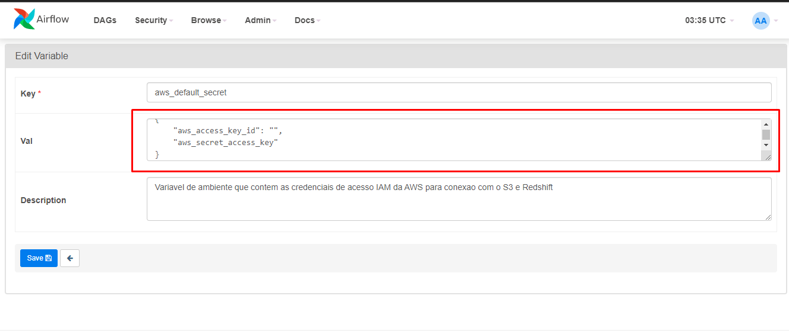
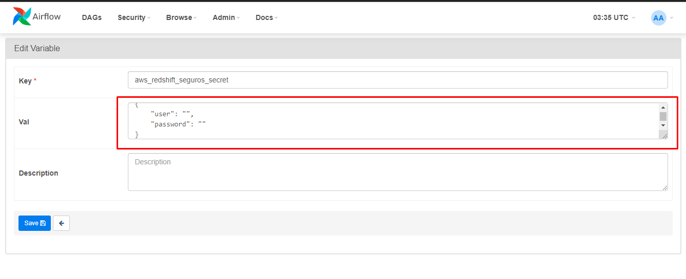

# Banco de Dados Dimensional

> Projeto pratico em modo de desafio com a criacao de um banco de dados dimensional desenvolvido como atividade avaliativa do Bootcamp Engenheiro de Dados da XPEducacao.
## **Estrutura do Projeto**

    ├─ dags: pasta de dags do Apache Airflow
    ├─ data: pasta auxiliar para armazenamento de dados durante a execucao das dags
    ├─ docs: pasta de documentacao do mkdocs
    │  └─ media
    │  └─ index.md: pagina inicial da documentacao do projeto
    ├─ logs: pasta de logs do Apache Airflow
    ├─ notebooks: jupyter notebook com a analise exploratoria dos dados
    ├─ plugins: plugin do Apache Airflow
    ├─ mkdocs.yaml: arquivo de configuracao do mkdocs
    ├─ README.md
    ├─ requirements.txt: bibliotecas requeridas para rodar o projeto
    ├─ docker-compose: arquivo para realizar o build dos containers docker do projeto


## **Objetivo do Projeto**

O modelo dimensional foi criado a partir das metricas propostas pelo [desafio](media/desafio_xp.pdf).

Visando tornar o projeto mais robusto, criou-se um pipeline de dados orquestrado pelo **Apache Airflow** que recupera os dados em formato `.csv`, realiza os procedimentos de transformacao e compatibilizacao dos dados com o modelo dimensional desenhado.

Os dados modelados sao colocados em um bucket da **AWS S3** e, por fim, os dados sao armazenados em um cluster na **AWS Redshift**.

Os dados do Redshift sao consumidos pelo **Power BI**, onde sera criado um dashboard de acordo com as metricas e necessidades de negocio levantadas.

## **Levantamento de Requisitos**
### Empresa de Seguros de Automoveis
- Cada cliente possui CPF, nome, sexo, endereço e telefones de contato (celular e fixo), mas podem vir a ter outros telefones no futuro. 
- Os carros possuem uma placa, marca, modelo, ano, chassi e cor. Cada carro tem determinado número de sinistros de acidentes associados a ele, sabendo que pode ter ocorrido múltiplos acidentes ou nenhum. 
- Já os sinistros devem ser identificados por um código único, data de ocorrência, hora de ocorrência, local de ocorrência (Endereço completo) e condutor, que pode ou não ser o titular da apólice e precisa ser devidamente registrado no sistema. Além disso, o sinistro possui um tipo de ocorrência (Colisão, Roubo ou Furto, Incêndio, Enchente, Retrovisor, dentre outros). 
- Um cliente ou pessoa pode ter várias apólices (mínimo uma) vigentes ou nenhuma, e cada apólice de seguro tem um identificador único e só pertence a um cliente e a somente um carro, mas pode ter vários condutores vinculados, e tem data de início e fim da vigência, valor total assegurado e valor franquia associados a ela.
- É importante saber que o carro pode ter várias apólices vinculadas a ele, mas apenas uma vigente.
- E sempre que houver um sinistro é preciso saber qual o carro envolvido, além do número da apólice, uma vez que este precisa ser assegurado por uma apólice. Mesmo que o atendimento seja para terceiros vai ser registrado no sinistro do carro vinculado à apólice da empresa em questão. 

## **Levantamento de Metricas**

O quadro abaixo contem todas as metricas que irao responder as questoes de negocio definidas
pela empresa.



## **Bus Matrix**

O quadro abaixo estabelece uma definicao dos grupos de dimensoes e fatos que devem estar no
modelo de dados do projeto. 




## **Modelo Multidimensional do Data Mart**



## **Stack Tecnologica**

[Apache Airflow 2.0](https://airflow.apache.org/)  
[AWS Redshift](https://aws.amazon.com/pt/redshift/)  
[AWS S3](https://aws.amazon.com/pt/s3/)  
[Docker 20.10.17](https://www.docker.com/)  
[Python 3.10.7](https://www.python.org/)  
[Power BI](https://powerbi.microsoft.com/pt-br/)    

## **Decisoes Arquiteturais do Projeto**

O `Apache Airflow` e o orquestrador de pipelines mais utilizado do mercado. Alem de ser flexivel tem uma 
interface bem intuitiva e permite a escalabilidade do projeto atraves dos seus diversos operadores e a 
possibilidade de processamento distribuido.    
O `AWS Redshift` foi escolhido por ser uma solucao totalmente gerenciada e permitir consumir os dados 
diretamento do `AWS S3`. Alem disso, o banco e otimizado para solucoes de DW.    
O `AWS S3` e muito utilizado no mercado pela sua flexibilidade e a possibilidade de consumo dos dados
em seu formato nativo. Alem disso e possivel separar o projeto em uma estrutura de pastas que auxilia o 
armazenamentos dos dados em todos os estagios do pipeline.  
O `Docker` permite uma maior compatibilidade e flexibilidade no ambiente de execucao do projeto. Alem disso
pode ser implementado nao apenas em servidores como tambem em solucoes serverless disponiveis em todas as 
plataformas de cloud.  
O `Power BI` foi escolhido por ser uma das solucoes de dataviz mais utilizadas pelo mercado, ser capaz de lidar
com grandes quantidades de dados e possuir diversos recursos para analise de dados.


## **Pipeline de Dados Apache Airflow

1. **Task docker-operator-etl:** task responsavel por executar todas as transformacoes nos dados de acordo com o modelo dimensional pre-definido. A task foi isolada em um container docker para facilitar a compatibilidades com as dependencias necessarias para execucao. Os detalhes das transformacoes podem ser encontrados aqui: [julioszeferino/docker-operator-etl](https://hub.docker.com/r/julioszeferino/docker-operator-etl).
2. **Task envia-arquivos-s3:** task responsavel por armazenar os aarquivos no bucket criado no s3.
3. **Task cria-tabelas-redshift:** task responsavel por estruturar o data warehouse no redshift.
4. **Task carrega-dados-redshift:** task responsavel por recuperar os dados do s3 e armazenar no cluster redshift do DW.
## **Como Executar este Projeto**

1. Crie uma instancia no `AWS EC2` ou outro provedor da sua escolha, realize o download deste repositorio e execute o docker-compose para realizar o build dos containers:
```bash
docker-compose up -d
```

2. Criar um bucket no `AWS S3` com o nome *etl-seguros*.
3. No painel web do `Apache Airflow` cadastrar a variavel *aws_default_secret* com os dados de acesso da sua conta aws:
```
{
    "aws_access_key_id": "",
    "aws_secret_access_key"
}
```

4. Crie um database chamado **seguros** dentro de cluster na `AWS Redshift`. No painel web do `Apache Airflow` cadastrar a variavel *aws_redshift_seguros_secret* com os dados de acesso ao banco:
```
{
    "user": "",
    "password": ""
}
```
5. Realizar o pull da imagem docker responsavel por realizar o processo de ETL nos dados
```bash
$ docker pull julioszeferino/docker-operator-etl
```
6. Executar o pipeline de dados no `Apache Airflow`
7. Configurar e criar as visualizacoes no `Power BI`


## **Configuracao das Variaveis no Apache Airflow**
A configuracao das variaveis de acesso a aws e ao redshift devem ser feitas na interface web do `Apache Airflow` que por padrao estara disponivel no endereco `http://localhost:8080`. Acesse a aba **Admin**>**Variables**:



## **Dashboard**
[](https://app.powerbi.com/view?r=eyJrIjoiNmIwNDg1ZjctZmY0YS00ZjYwLTlhYjgtMjcxNjQyZDJhZWY1IiwidCI6IjM0Zjc1YTY1LWUzYWItNDY3Yy1hNzhhLTcxNjkwNTBjMWY5MSJ9)  
